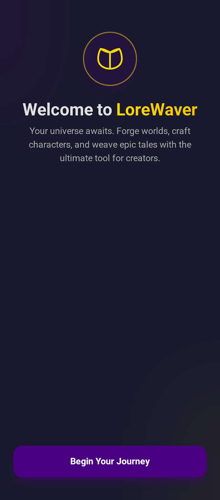
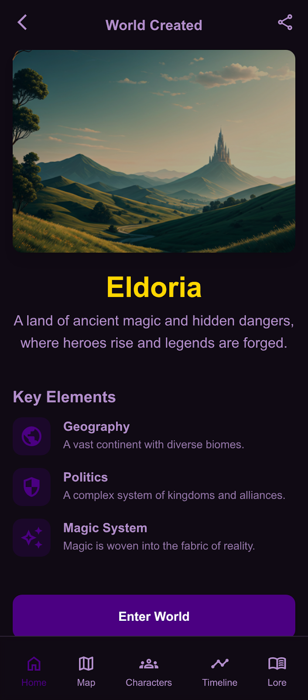
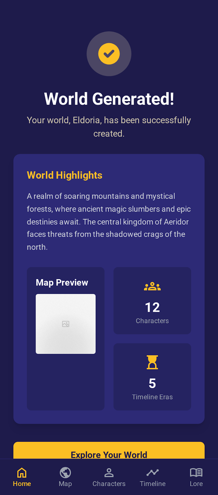
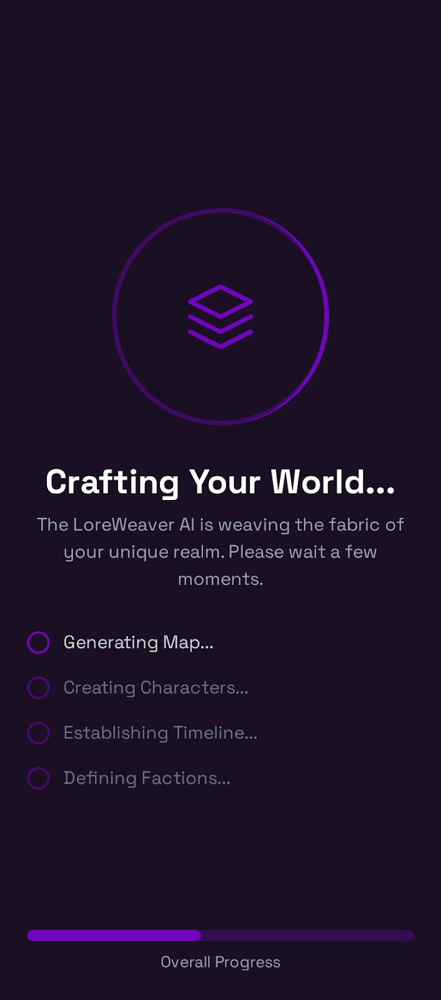
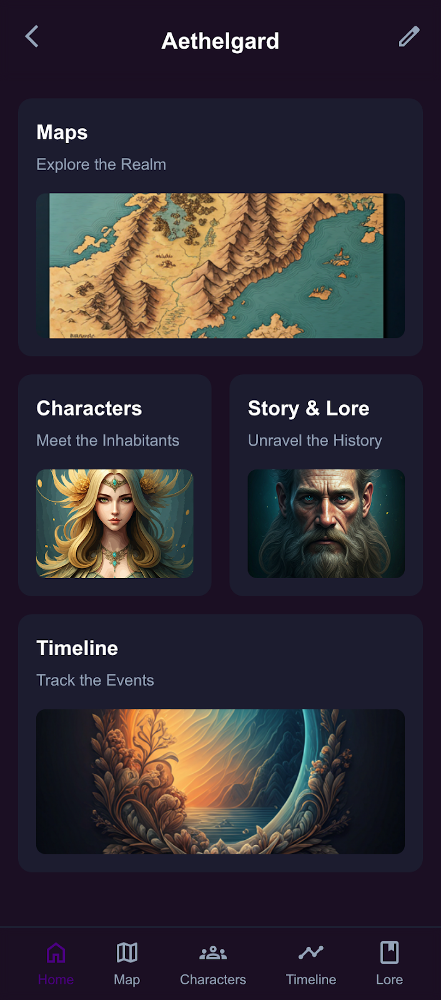
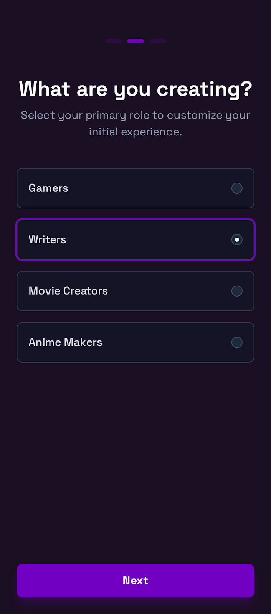
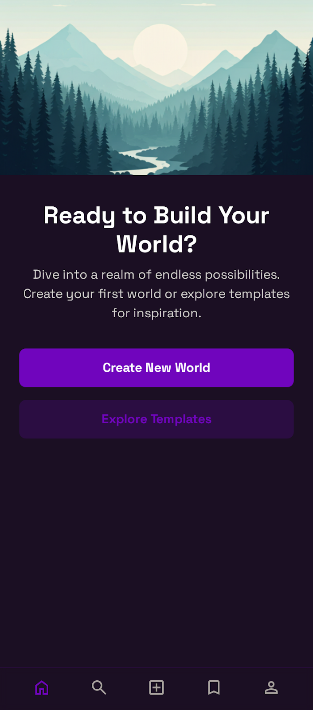

🌌 LoreWaver
AI-powered mobile app for immersive fantasy world creation. Built with Flutter, designed for storytellers, game masters, and visual creators.
## Design Preview

👥 Target Users & Their Needs
User Type	Needs & Use Cases
🧙 Gamers	Build RPG worlds, design quests, create NPCs, track campaign timelines
✍️ Writers	Develop characters, plot arcs, lore, and world history with rich text tools
🎬 Movie Creators	Visualize scenes, track character evolution, storyboard timelines
🎨 Anime Makers	Design fantasy settings, character relationships, and episode arcs
📱 App Modules
1. 🗺️ World Dashboard
Overview of all world elements: maps, characters, events, lore

Search, filter, and tag system for fast navigation

2. 🧭 Map Creator
Drag-and-drop terrain editor (mountains, forests, cities)

Region tagging (e.g., factions, danger zones)

Zoom/pan with custom overlays (flutter_map, interactiveviewer)

3. 🧝 Character Builder
Create characters with race, role, traits, relationships

Visual relationship graph (graphview)

Timeline of character evolution

4. 📆 Timeline & Story Arc
Chronological event builder with branching paths

Link events to characters, locations, and lore

Visual timeline UI (timelines, syncfusion_flutter_calendar)

5. 📖 Lore Notebook
Rich text editor (flutter_quill, Zefyr) for writing lore, scenes, and backstories

Markdown support for formatting

Tagging and linking to characters/events

🧠 Smart Features (Optional AI Integration)
✨ AI-assisted lore generation (e.g., “Generate a backstory for this kingdom”)

🧩 Auto-suggest character traits or plot twists

🗺️ Procedural map generation starter templates

🛠 Tech Stack Summary
Layer	Tools
UI	Flutter, Riverpod/Bloc, go_router
Storage	Hive (local), SQLite, or Firebase
Rich Text	flutter_quill, Zefyr
Map Engine	flutter_map, Google Maps
Timeline	timelines, syncfusion_flutter_calendar
Graphs	graphview
AI (opt.)	OpenAI API, local LLMs, or custom prompt engine
🚀 Getting Started
Clone the repo git clone https://github.com/your-org/lorewaver.git

Install dependencies flutter pub get

Run the app flutter run

📦 Folder Structure
Code
lib/
├── modules/
│   ├── dashboard/
│   ├── map_creator/
│   ├── character_builder/
│   ├── timeline_arc/
│   └── lore_notebook/
├── shared/
│   ├── widgets/
│   ├── models/
│   └── services/
├── core/
│   ├── routing/
│   ├── state/
│   └── themes/
🤝 Contributing
We welcome contributions from world-builders and Flutter devs alike! Please check out our CONTRIBUTING.md for guidelines on:

Feature proposals

Bug reports

Localization and accessibility

AI prompt tuning

📄 License
This project is licensed under the MIT License. See the LICENSE file for details.
